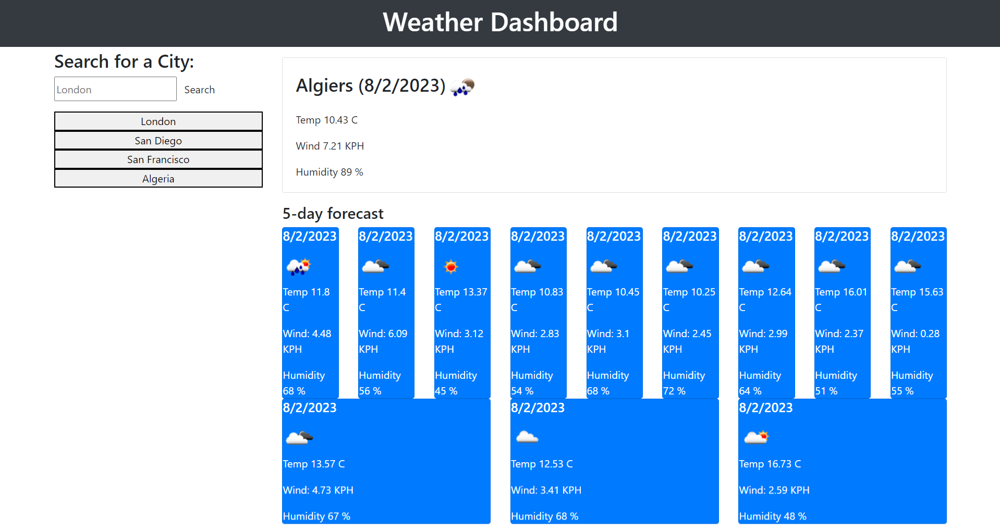

# Module 8 Assignment

# Building a Weather Dashboard

## Description:

I built this project to display a working display of the weather of cities using a weather API  

The dashboard even displays the future forecast and retains the input of the user

## Deployed Link:

https://adammbnitro.github.io/Weather-Dashboard/

## License 

Copyright (c). All rights reserved.

Licensed under the MIT license.